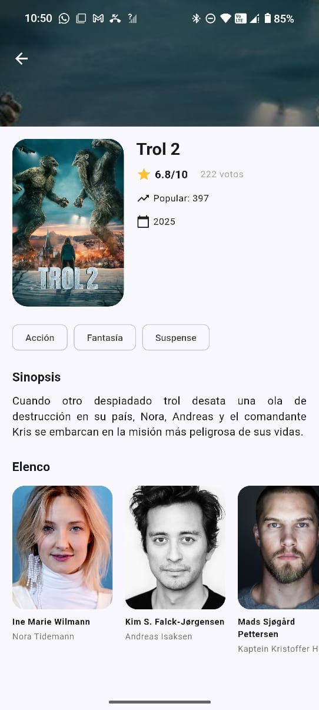

# Cinemapedia_220083

<div align="center">
  
  
  ### Práctica 07: Implementación Completa de Búsqueda y Gestión de Contenido Multimedia
  
  **Desarrollo de Aplicaciones Móviles**  
  **Instituto Tecnológico de Puebla**
  
  ---
  
  **Desarrollador:** Juan Alberto Vázquez Herández  
  **Matrícula:** 220083  
  **Fecha:** Diciembre 2025  
  **Versión:** 2.0
</div>

---

## Descripción del Proyecto

**Cinemapedia** es una aplicación móvil multiplataforma desarrollada en Flutter que consume la API de TheMovieDB (TMDB) para proporcionar información completa sobre películas y series de televisión. La aplicación implementa Clean Architecture, gestión de estado con Riverpod 3.x y navegación declarativa con GoRouter.

---

## Objetivos de la Práctica

### Objetivo General
Implementar un sistema completo de búsqueda contextual para películas y series, integrando funcionalidades avanzadas de UI/UX y manteniendo la arquitectura limpia del proyecto.

### Objetivos Específicos

1. **Búsqueda Contextual**
   - Implementar búsqueda de películas con debouncing
   - Implementar búsqueda de series con debouncing
   - Detectar automáticamente el contexto (películas vs series)

2. **Arquitectura y Estado**
   - Mantener Clean Architecture en toda la aplicación
   - Implementar providers de búsqueda con Riverpod 3.x
   - Gestionar estados de carga y errores

3. **Interfaz de Usuario**
   - Crear SearchDelegates personalizados
   - Implementar animaciones fluidas
   - Diseñar componentes reutilizables

---

## Actividades Realizadas

### **Fase 1: Fundamentos (Práctica Anterior)**
- Clonación/Ramificación: Preparación del entorno de desarrollo
- Entidad y Modelo de Actores: Estructuras de datos para actores
- Datasource: Consumo de endpoints de API para actores
- Mappers: Deserialización correcta del modelo Actor
- Providers (Riverpod v3): Gestión de estado de actores
- GoRouter: Configuración de rutas para detalles
- Elementos Visuales (Detalles): Vista completa de película
- Elementos Visuales (Actores): Lista y información de actores
- Testeo: Verificación de funcionalidades

### **Fase 2: Búsqueda y Series (Práctica Actual)**

#### **2.1 Actualización de Contratos**
- Agregado método `searchMovies()` en datasources y repositories
- Agregado método `searchSeries()` en datasources y repositories
- Implementación de búsqueda en datasources de TheMovieDB
- Implementación en repositories impl

#### **2.2 Providers de Búsqueda**
- Creación de `search_movies_provider.dart` (Riverpod 3.x)
- Creación de `search_series_provider.dart` (Riverpod 3.x)
- Implementación de `SearchQueryNotifier` para películas
- Implementación de `SearchQueryNotifier` para series
- Cache de resultados de búsqueda

#### **2.3 SearchDelegates**
- Creación de `SearchMovieDelegate` con:
  - Debouncing de 500ms
  - Streams reactivos para resultados
  - Loading indicators animados
  - Clear button
- Creación de `SearchSeriesDelegate` con las mismas características
- Widgets `_MovieItem` y `_SeriesItem` para resultados

#### **2.4 Integración UI**
- Actualización de `CustomAppbar` con búsqueda contextual
- Detección automática de pantalla (películas/series)
- Navegación a detalles desde resultados
- Persistencia de query entre búsquedas

#### **2.5 Gestión de Series**
- Implementación completa de datasources para series
- Providers para 5 categorías de series:
  - Airing Today (En emisión)
  - Popular
  - Top Rated
  - Upcoming
  - Mexican Series
- Pantalla de series con slideshow y listas horizontales
- Pantalla de detalles de series
- Loading con progreso visual

#### **2.6 Mejoras de UI/UX**
- Splash screen con animaciones y audio
- Sistema de clasificación por edades (G, PG, PG-13, R)
- Formateo de fechas en español (es_MX)
- Loading screens con porcentaje de progreso
- Navegación fluida entre películas y series

---

## Estructura Completa del Proyecto
```
lib/
├── config/                                    # Configuración general
│   ├── constants/
│   │   └── environment.dart                   # Variables de entorno (API Keys)
│   ├── helpers/
│   │   ├── human_formats.dart                 # Formateo de números (1.5M, 2.3K)
│   │   └── rating_helper.dart                 # Sistema de clasificación por edades
│   ├── router/
│   │   └── app_routes.dart                    # Rutas (GoRouter con splash, movies, series)
│   └── theme/
│       └── app_theme.dart                     # Tema visual (Material 3, color seed)
│
├── domain/                                    # Lógica de negocio pura
│   ├── datasources/                           # Contratos de fuentes de datos
│   │   ├── actors_datasource.dart             # Contrato para obtener actores
│   │   ├── movies_datasource.dart             # Contrato películas (+ searchMovies)
│   │   └── series_datasource.dart             # Contrato series (+ searchSeries)
│   ├── entities/                              # Modelos de negocio
│   │   ├── actor.dart                         # Entidad Actor
│   │   ├── movie.dart                         # Entidad Movie
│   │   └── series.dart                        # Entidad Series
│   └── repositories/                          # Contratos de repositorios
│       ├── actors_repository.dart             # Repositorio actores
│       ├── movies_repository.dart             # Repositorio películas
│       └── series_repository.dart             # Repositorio series
│
├── infrastructure/                            # Implementaciones
│   ├── datasources/                           # Implementaciones de fuentes de datos
│   │   ├── actor_moviedb_datasource.dart      # Actores desde TheMovieDB
│   │   ├── moviedb_datasource.dart            # Películas + searchMovies()
│   │   └── moviedb_series_datasource.dart     # Series + searchSeries()
│   ├── mappers/                               # Transformadores (API a Entities)
│   │   ├── actor_mapper.dart                  # Cast a Actor
│   │   ├── movie_mapper.dart                  # MovieDB/Details a Movie
│   │   └── series_mapper.dart                 # SeriesDB/Details a Series
│   ├── models/                                # Modelos de respuesta API
│   │   └── moviedb/
│   │       ├── credits_response.dart          # Modelo créditos (cast y crew)
│   │       ├── movie_details.dart             # Modelo detallado película
│   │       ├── movie_moviedb.dart             # Modelo básico película
│   │       ├── moviedb_response.dart          # Respuesta paginada películas
│   │       ├── series_details.dart            # Modelo detallado series
│   │       ├── series_moviedb.dart            # Modelo básico series
│   │       └── seriesdb_response.dart         # Respuesta paginada series
│   └── repositories/                          # Implementaciones repositorios
│       ├── actor_repository_impl.dart         # Impl repositorio actores
│       ├── movie_repository_impl.dart         # Impl repositorio películas
│       └── series_repository_impl.dart        # Impl repositorio series
│
├── presentation/                              # UI y Estado
│   ├── delegates/                             # Delegados personalizados
│   │   ├── search_movie_delegate.dart         # SearchDelegate películas (debouncing)
│   │   └── search_series_delegate.dart        # SearchDelegate series (debouncing)
│   ├── providers/                             # Gestión de estado (Riverpod 3.x)
│   │   ├── actors/
│   │   │   ├── actors_by_movie_provider.dart      # Cache actores por película
│   │   │   └── actors_repository_provider.dart    # Provider repositorio actores
│   │   ├── movies/
│   │   │   ├── initialLoading_provider.dart       # Loading inicial películas
│   │   │   ├── loading_progress_provider.dart     # Progreso de carga (porcentaje)
│   │   │   ├── mexican_movies_sorted_provider.dart # Películas mexicanas ordenadas
│   │   │   ├── movie_info_provider.dart           # Cache detalles película
│   │   │   ├── movie_slideshow_provider.dart      # Provider slideshow (top 6)
│   │   │   ├── movies_providers.dart              # 5 categorías
│   │   │   ├── movies_repository_provider.dart    # Provider repositorio películas
│   │   │   └── upcoming_this_month_provider.dart  # Estrenos del mes
│   │   ├── search/
│   │   │   ├── search_movies_provider.dart        # Búsqueda películas (Riverpod 3.x)
│   │   │   └── search_series_provider.dart        # Búsqueda series (Riverpod 3.x)
│   │   ├── series/
│   │   │   ├── initialLoading_series_provider.dart # Loading inicial series
│   │   │   ├── loading_progress_series_provider.dart # Progreso series
│   │   │   ├── series_info_provider.dart          # Cache detalles series
│   │   │   ├── series_providers.dart              # 5 categorías series
│   │   │   ├── series_providers_export.dart       # Barrel file series
│   │   │   ├── series_repository_provider.dart    # Provider repositorio series
│   │   │   └── series_slideshow_provider.dart     # Slideshow series
│   │   └── providers.dart                     # Barrel file (exporta todos)
│   ├── screens/                               # Pantallas
│   │   ├── movies/
│   │   │   ├── home_screen.dart               # Pantalla principal películas
│   │   │   ├── movie_detail_screen.dart       # Detalles película
│   │   │   └── movie_screen.dart              # Screen simple película
│   │   ├── series/
│   │   │   ├── series_screen.dart             # Pantalla principal series
│   │   │   └── series_detail_screen.dart      # Detalles series
│   │   ├── splash/
│   │   │   └── splash_screen.dart             # Splash animado con audio
│   │   └── screens.dart                       # Barrel file screens
│   └── widgets/                               # Widgets reutilizables
│       ├── movies/
│       │   ├── movie_horizontal_listview.dart      # Lista horizontal películas
│       │   ├── movie_horizontal_listview_upcoming.dart # Lista estrenos con fechas
│       │   └── movie_slideshow.dart                # Carrusel películas
│       ├── series/
│       │   ├── series_horizontal_listview.dart     # Lista horizontal series
│       │   └── series_slideshow.dart               # Carrusel series
│       ├── shared/
│       │   ├── custom_appbar.dart                  # AppBar con búsqueda contextual
│       │   ├── custom_bottom_navigationbar.dart    # Navegación inferior (3 tabs)
│       │   └── fullscreen_loader.dart              # Loader con progreso
│       └── widgets.dart                       # Barrel file widgets
│
└── main.dart                                  # Punto de entrada
```

---

## Tecnologías y Paquetes

### **Core**
- **Flutter SDK**: Framework multiplataforma
- **Dart**: Lenguaje de programación

### **State Management**
- `flutter_riverpod: ^2.5.1` - Gestión de estado reactiva (v3.x)

### **Navegación**
- `go_router: ^14.6.2` - Navegación declarativa

### **Networking**
- `dio: ^5.7.0` - Cliente HTTP
- `flutter_dotenv: ^5.2.1` - Variables de entorno

### **UI/UX**
- `animate_do: ^3.3.4` - Animaciones predefinidas
- `card_swiper: ^3.0.1` - Carruseles de imágenes
- `just_audio: ^0.9.42` - Reproducción de audio (splash)

### **Internacionalización**
- `intl: ^0.19.0` - Formateo de fechas y números

---

## Instalación y Configuración

### **Requisitos Previos**
- Flutter SDK 3.0+
- Dart SDK 3.0+
- Android Studio / VS Code
- Cuenta en TheMovieDB

### **Pasos de Instalación**

1. **Clonar el repositorio**
```bash
git clone https://github.com/tuusuario/cinemapedia_220083.git
cd cinemapedia_220083
```

2. **Instalar dependencias**
```bash
flutter pub get
```

3. **Configurar API Key**

Crear archivo `.env` en la raíz:
```env
THE_MOVIEDB_KEY=tu_api_key_aqui
```

4. **Ejecutar la aplicación**
```bash
flutter run
```

---

## Autor

**Juan Alberto Vázquez Herández**  
Matrícula: 220083  
Instituto Tecnológico de Puebla  
Ingeniería en Sistemas Computacionales

---

**Desarrollado con Flutter para Desarrollo de Aplicaciones Móviles**